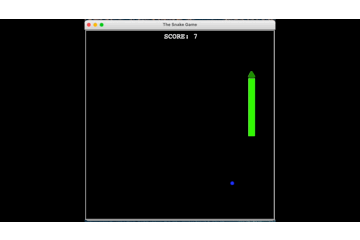

# The Classic Snake Game

* * *

### Reimagined in Python v3.9 using Turtle
 
**WARNING: Can Be Addictive!**

In this single player game, you control the head of the snake by going in any direction except for backwards. As you move your snake forward, your goal is to consume the food which increases your score. However, consuming that food also increases the length of your snake. The game is over when you direct your snake to run into the wall (window border) or your own tail.
  
[Learn more about the history of the snake game](https://en.wikipedia.org/wiki/Snake_(video_game_genre))

* * *

## Installation:

**With Python 3 using the console**
>1. Download the snake_game folder 
>2. Place the folder into your python directory
>3. Open the console app and type: `python3 /<path to your python directory>/snake_game/main.py`

 

**With Pycharm**
[_taken directly from the pycharm website_](https://www.jetbrains.com/help/pycharm/set-up-a-git-repository.html#put-existing-project-under-Git)

>1. From the main menu, select Git | Clone, or, if no project is currently opened, click Get from VCS on the Welcome screen.
>2. In the Get from Version Control dialog, specify the URL of the remote repository you want to clone, or select one of the VCS hosting services on the left.
>If you are already logged in to the selected hosting service, completion will suggest the list of available repositories that you can clone.
>3. Click Clone. If you want to create a project based on the sources you have cloned, click Yes in the confirmation dialog. Git root mapping will be automatically set to the project root directory.
>If your project contains submodules, they will also be cloned and automatically registered as project roots.

 

**Other _similar to pycharm_ integrated development environments (IDE)**

&nbsp;&nbsp;&nbsp;&nbsp; check the IDE creator's website for this specific information. Here are a few different ways you may find this information to be labeled._
>1. Check out a project from a remote host
>2. Clone a project from github
>3. Download files into application

* * *

## Directions:
>> Use the arrow keys to control the snake  
>> ⬆︎ UP  
>> ⬇︎ DOWN  
>> ⬅︎ LEFT 
>> ⮕ RIGHT 

## Thank You for Playing!
* * *

## License

>**[View the MIT License agreement](LICENSE.md)**

>###     Copyright © 2021 Jim Bray and others,  &nbsp; All Rights Reserved

